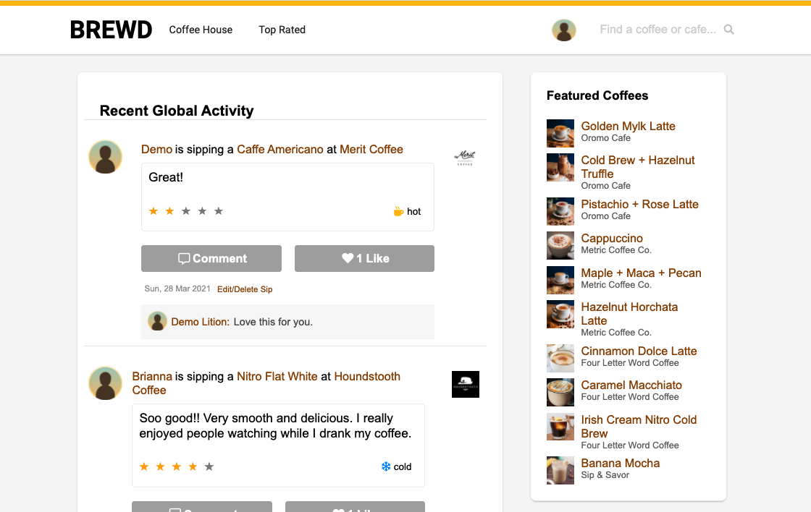

<br />
<p align="center">
  <a href="https://github.com/tedjanton/Brewd">
    
  </a>

  <h3 align="center">BREWD - Drink Socially</h3>

  <p align="center">
    BREWD is a coffee-drinker's community based on the popular beer-aficionado social site UNTAPPED. Coffee-lovers are able to browse recent coffee "sip" activity, view top-rated coffees to sip, and shop locations. Once you find a coffee that you love...or hate...while browsing, users can create, then edit or delete, their own sips of coffee. Users can also add comments on or like other user's sips, making social interaction a key component of the Brewd community.
    <br />
    <a href="https://github.com/tedjanton/Brewd/wiki"><strong>Explore the docs »</strong></a>
    <br />
    <br />
    <a href="https://brewd-app.herokuapp.com/">View Site</a>
    ·
    <a href="https://github.com/tedjanton/Brewd/issues">Report Bug</a>
    ·
    <a href="https://github.com/tedjanton/Brewd/issues">Request Feature</a>
  </p>
</p>


<!-- TABLE OF CONTENTS -->
<details open="open">
  <summary><h2 style="display: inline-block">Table of Contents</h2></summary>
  <ol>
    <li>
      <a href="#about-the-project">About The Project</a>
      <ul>
        <li><a href="#built-with">Built With</a></li>
      </ul>
    </li>
    <li>
      <a href="#getting-started">Getting Started</a>
      <ul>
        <li><a href="#prerequisites">Prerequisites</a></li>
        <li><a href="#installation">Installation</a></li>
      </ul>
    </li>
    <li><a href="#usage">Usage</a></li>
    <li><a href="#roadmap">Roadmap</a></li>
    <li><a href="#contributing">Contributing</a></li>
    <li><a href="#license">License</a></li>
    <li><a href="#contact">Contact</a></li>
    <li><a href="#acknowledgements">Acknowledgements</a></li>
  </ol>
</details>

<!-- ABOUT THE PROJECT -->
## About The Project
[Click here to view Brewd live on the web!](https://brewd-app.herokuapp.com/)
<br>
   
   
</br>


### Built With

* [JavaScript]()
* [Python]()
* [React]()
* [Redux]()
* [Flask]()
* [SQLAlchemy]()
* [Docker]()
* [CSS]()


<!-- GETTING STARTED -->
## Getting Started

To get a local copy up and running follow these simple steps.

### Prerequisites

Here is everything we need you to do to get started with Brewd.

  * npm
  ```sh
  npm install npm@latest -g
  ```
  * pipenv
  ```
  pipenv install
  ```

### Installation

1. Clone the repo
   ```sh
   git clone https://github.com/tedjanton/Brewd
   ```
2. Install NPM packages in the React App
   ```sh
   npm install
   ```
3. Install Dependencies
   ```bash
   pipenv install --dev -r dev-requirements.txt && pipenv install -r requirements.txt
   ```

4. Add a '.env' with your environment variables to the root of your local directory

5. Create a postgreSQL user
    ```sh
    CREATE USERS <<your username>> WITH PASSWORD <<your password>> CREATEDB
    ```
6. Create your database
    ```sh
   CREATE DATABASE <<database name>> WITH OWNER <<your username>>
    ```
7. Start a pipenv virtual environment
   ```bash
   pipenv shell
   ```
8. Migrate and seed your database
    ```sh
    flask db migrate
    ```
    ```bash
   flask db upgrade
   ```
   ```bash
   flask seed all
   ```
   ```bash
   flask run
   ```
9. Start your local development server in the React App
   ```bash
   npm start
   ```
## Obstacles

### SQLAlchemy Querying

Because of how we built our lean database, we needed to create unique ways to query data due to interdependent relationships. We defined the necessary relationships between tables and created new methods that allowed us to return information pertaining to multiple tables without running into major conflicts.


### Likes

We had issues with React updating and rendering the state of a like without refreshing our entire page. Through hours of debugging and collaboration, we realized we overcomplicated the issue from the start.


<!-- ROADMAP -->
## Roadmap

See the [open issues](https://github.com/tedjanton/Brewd/issues) for a list of proposed features (and known issues).


<!-- CONTRIBUTING -->
## Contributing

Contributions are what make the open source community such an amazing place to be learn, inspire, and create. Any contributions you make are **greatly appreciated**.

1. Fork the Project
2. Create your Feature Branch (`git checkout -b feature/AmazingFeature`)
3. Commit your Changes (`git commit -m 'Add some AmazingFeature'`)
4. Push to the Branch (`git push origin feature/AmazingFeature`)
5. Open a Pull Request


<!-- CONTACT -->
## Contact & Acknowledgements

* Ted Anton - [LinkedIn](https://www.linkedin.com/in/ted-anton/) - [GitHub](https://github.com/tedjanton)
* Olivia Young - [LinkedIn](https://www.linkedin.com/in/olivia-young-2437ba1b9/) - [GitHub](https://github.com/olivianicole)
* Lauren Chambers - [LinkedIn](https://www.linkedin.com/in/lauren-chambers94/) - [Github](https://github.com/laurenchambers)
* Raj Hudek - [LinkedIn](https://www.linkedin.com/in/raj-hudek-026b051b1/) - [Github](https://github.com/LifeJunkieRaj)

Project Link: [https://github.com/tedjanton/Brewd](https://github.com/tedjanton/Brewd)


<!-- ACKNOWLEDGEMENTS -->
